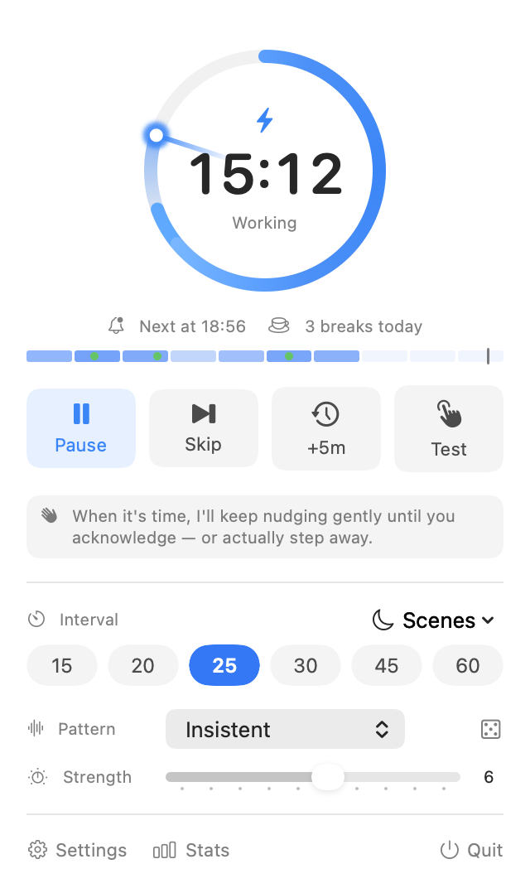
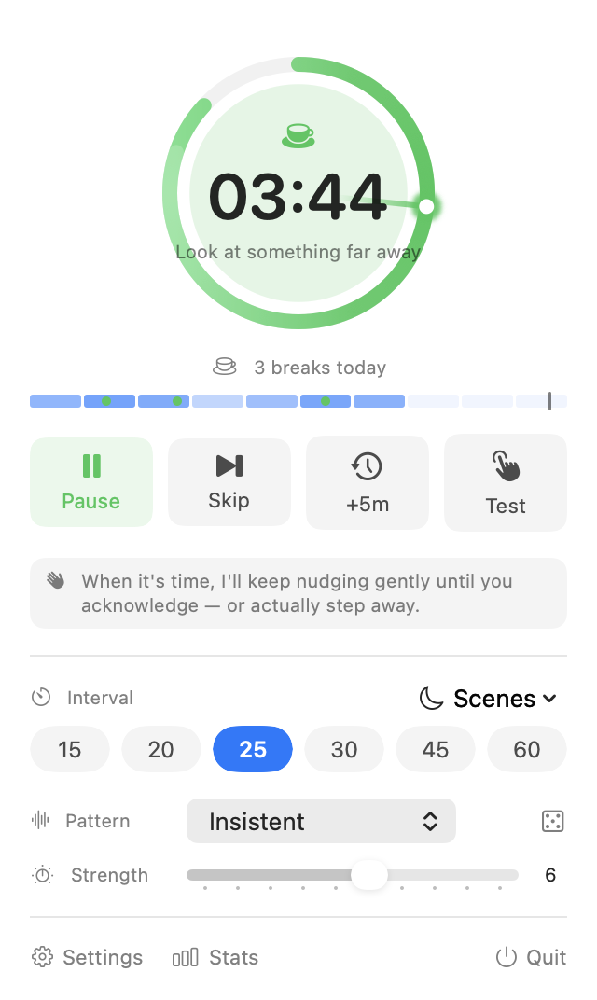
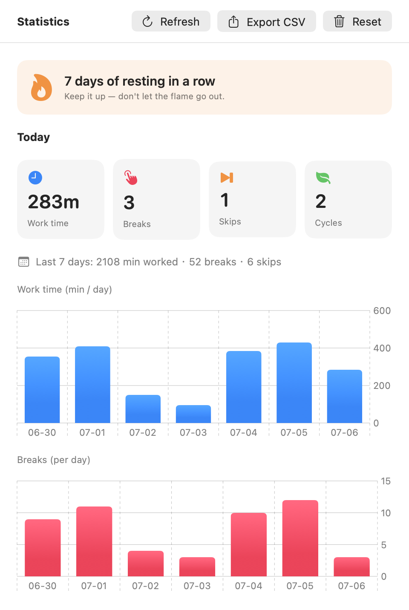
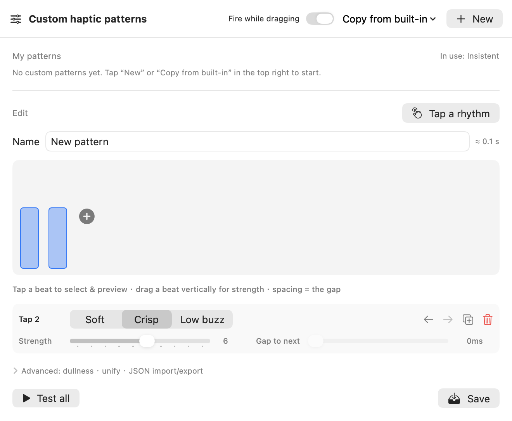

<div align="center">


# HapticBreak

**A break reminder you _feel_ — never see, never hear.**

When it's time, HapticBreak taps you on the palm through your trackpad. No pop‑up. No sound. No one around you notices — and your flow never breaks.

<b>English</b> · <a href="README.zh-CN.md">简体中文</a> · <a href="https://tmpbin.github.io/HapticBreak/">Website</a>


</div>

---

## Why you'll like it

You sit down and three hours vanish. Dry eyes, stiff neck, numb wrists — your body sounded the alarm long ago; you just didn't hear it.

Every other break app plays one of three cards:

- **Full‑screen overlays** — hijack your screen and yank you out of the zone.
- **System notifications** — gone in a glance, and muted the moment you turn on Focus.
- **Sounds** — great, until you're in a meeting, a library, or an open‑plan office.

They all fight your attention. HapticBreak uses a channel that was there all along: **since 2015, every MacBook trackpad hides a Taptic Engine** — a precise little vibration motor sitting right under the wrist you're already resting there. When it's time, it gives you one perfectly judged tap. **You get the message. The world stays undisturbed.**

---

## The magic is in the rhythm

A buzz is just a buzz. **A rhythm is a feeling.** HapticBreak treats your trackpad like a tiny instrument.

- **29 built‑in patterns** across three moods — **Basic**, **Nature**, and **Rhythm** — from a gentle tap to a bouncing‑ball accelerando to a driving groove.
- **Motifs you'll recognize by touch alone.** Some grooves are so iconic you can name the tune from the beat in your palm:
  - **Fate** — Beethoven's 5th: _dit‑dit‑dit‑**daah**_.
  - **Stomp Clap** — the stadium _boom‑boom‑**clap**_.
  - **Jingle Bells** — _jin‑gle‑bells, jin‑gle‑bells_, straight to your palm.
  - **Happy Birthday** · **Frère Jacques** · **School Bell** (Westminster chime) · **Secret Mission** — tunes half the planet grew up on.
  - **Shave & Haircut** — the seven‑tap knock everyone finishes in their head.
- **Compose your own.** The **Pattern Editor** is a beat canvas: tap a bar to hear it, drag it up or down to set strength — or hit **Record a rhythm** and simply tap the beat you have in your head; every tap becomes a beat, every pause becomes the gap. Patterns import/export as plain JSON (perfect for sharing — or letting an AI write one for you).
- **Tuned by feel.** Every pattern rides a three‑axis engine (timbre × strength × "dullness"); a built‑in **Haptic Lab** lets you calibrate it to how _your_ Mac feels.

> The countdown ring plays along too: it releases a spark of energy every second, with an optional faint haptic "heartbeat" ticking in sync while the panel is open.

---

## See it

|  Control panel — the per‑second energy ring | Resting — a slow breathing glow |
|:--:|:--:|
|  |  |
| **Statistics — honest breaks + daily streak** | **Pattern editor — design your own groove** |
|  |  |

---

## Install

> HapticBreak works through trackpad haptics — it needs a built‑in **Force Touch trackpad** or a **Magic Trackpad 2 (or newer)**.

### Recommended: Homebrew (install and upgrade in one line)

```bash
brew tap tmpbin/tap
brew install --cask hapticbreak
xattr -dr com.apple.quarantine /Applications/HapticBreak.app   # allow the unnotarized build once
brew upgrade --cask hapticbreak                                 # upgrades later are one command
```

### Or download the `.dmg` and allow it once

An unnotarized build is blocked by macOS on first launch (on Apple Silicon it shows _"'HapticBreak' is damaged"_ — the app isn't broken; that's Gatekeeper's default stance toward downloaded, unnotarized apps). Pick one:

```bash
# A) strip the quarantine flag (cleanest, once)
xattr -dr com.apple.quarantine /Applications/HapticBreak.app

# B) right‑click the app → Open → Open again in the dialog (first time only)
```

---

## Get started in 60 seconds

1. **Launch it.** A small hand icon with a live countdown appears in the menu bar; the control panel opens by itself on first run.
2. **Feel it.** Rest your fingers on the trackpad and hit **Test** — then roll the **dice** for a random pattern, or browse the picker (every selection previews instantly). Drag the strength slider until it feels right on your palm.
3. **Pick your pace.** Choose an interval — 25 minutes is the default and a good one.
4. **Close the panel and forget it.** That's the whole setup. Meetings, full‑screen talks, Focus mode and stepping away are all detected automatically — and whenever it pauses itself, the panel tells you why and when it'll be back.

### When a reminder arrives

- Your trackpad plays the full reminder every 10 s (haptics + sound + screen flash, if enabled). The menu‑bar icon flashes the whole time.
- **Take the break, any way you like:**
  - **triple‑tap** the trackpad with three fingers,
  - press **`⌃⌥⏎`**,
  - click the countdown **ring** (or the *Start break* button),
  - or just **stand up and walk away** — 30 seconds away counts by itself.
- **Not now?** *Skip* it, push it back *+5 min*, or simply keep working — after a few unanswered nudges it postpones quietly on its own. It never nags forever.
- If you're mid‑sentence at the deadline, it **waits for a natural typing pause** before buzzing.
- Statistics stay **honest**: a reminder firing counts for nothing — a break is only recorded when you actually step away.

---

## Going further

- **Work / rest cycles** — In *Settings → Basic*, set a rest length above 0 (e.g. 25 + 5). Acknowledging a reminder then starts a rest countdown: the ring turns green, breathes slowly, and rotates gentle tips (stretch, look far away, get some water). Completed cycles are counted for you.
- **Quick scenes** — The **Scenes** menu in the panel makes temporary decisions that undo themselves: **Focus for 90 min** (one long stretch, then back to your rhythm), **Quiet for 1 hour** (an off‑the‑record call), **Done for today** (see you tomorrow morning). Unlike a bare pause, there's nothing to remember to switch back.
- **Read your day at a glance** — the thin band in the panel is your day: shading = how hard each hour worked, green dots = real breaks, the thin line = now. Click it for full statistics (7‑day chart, streak, CSV export).
- **Tune the nudging** — *Settings → Advanced*: nudge spacing and cap, postpone length, the early heads‑up tap, typing‑aware deferral, and each auto‑pause trigger individually.
- **Make the shortcuts yours** — *Settings → Advanced → Global shortcuts*: click a combo and press a new one (defaults: `⌃⌥Space` pause · `⌃⌥S` skip · `⌃⌥B` buzz now · `⌃⌥⏎` start break). No Accessibility permission needed.
- **Compose your own pattern** — *Settings → Advanced → Pattern editor*: tap out a rhythm on the record pad or arrange beats on the canvas, preview by touch, and share as plain JSON.
- **Calibrate to your machine** — *About → click the actuator status five times* opens the hidden **Haptic Lab**: confirm the three timbres feel right on your exact trackpad (swap in an alternative feel if not) and audition the full 1→10 strength ladder.
- **Fit your menu bar** — icon + countdown, icon only, or a minimal progress ring; optional screen flash and system chime as extra channels.
- **Three languages** — English / 简体中文 / 日本語, following the system or switched instantly.

---

## Developers

Everything is plain Swift — build, test and audition from the command line:

```bash
./build.sh release               # → build/HapticBreak.app (current arch only)
./build.sh release dmg universal # → Universal binary (arm64 + x86_64) + .dmg
swift test                       # unit tests
scripts/release-check.sh --universal --dmg  # full pre‑release gate (Universal)

swift run HapticBreak --presets    # feel all 29 patterns back‑to‑back (optional strength: --presets 8)
swift run HapticBreak --hapticlab  # open the calibration bench directly
```

Pushing a `vX.Y.Z` tag triggers the [release pipeline](.github/workflows/release.yml): tests, packaging, release notes from [`CHANGELOG.md`](CHANGELOG.md), and a GitHub Release. Add signing/notarization secrets and the same pipeline ships a download‑and‑go build with silent in‑app updates — setup notes in [`packaging/autoupdate/README.md`](packaging/autoupdate/README.md).

---

## Notes & limits

- **HapticBreak is currently in beta.** The core reminder loop is stable and tested, but expect rough edges — issues and feedback are very welcome.
- Unnotarized standalone builds need a one‑time manual allow (above); configuring signing secrets removes that entirely.
- Focus / Do Not Disturb detection is best‑effort (it reads a system file); an OS revision may change it, but it never affects the core reminder.
- The precise‑haptics path uses a private API and could shift across macOS versions; a public‑API fallback is built in.
