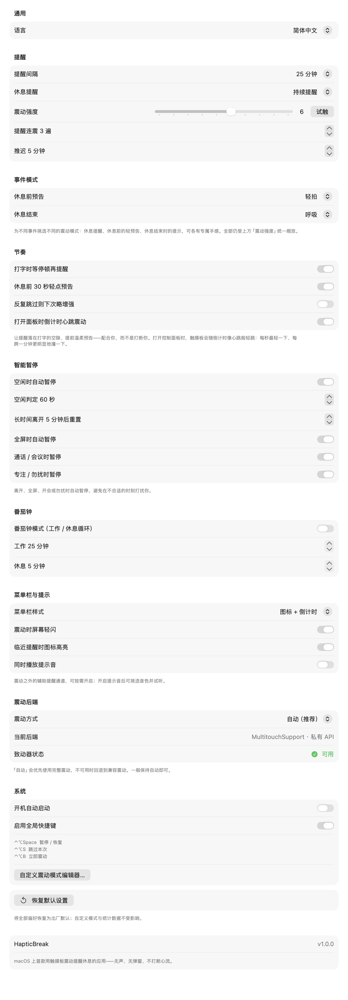

<div align="center">


# HapticBreak

**A break reminder you _feel_ — never see, never hear.**

When it's time, HapticBreak taps you on the palm through your trackpad. No pop‑up. No sound. No one around you notices — and your flow never breaks.

<b>English</b> · <a href="README.zh-CN.md">简体中文</a>


</div>

---

## Why you'll like it

You sit down and three hours vanish. Dry eyes, stiff neck, numb wrists — your body sounded the alarm long ago; you just didn't hear it.

Every other break app plays one of three cards:

- **Full‑screen overlays** — hijack your screen and yank you out of the zone.
- **System notifications** — gone in a glance, and muted the moment you turn on Focus.
- **Sounds** — great, until you're in a meeting, a library, or an open‑plan office.

They all fight your attention. HapticBreak uses a channel that was there all along: **since 2015, every MacBook trackpad hides a Taptic Engine** — a precise little vibration motor sitting right under the wrist you're already resting there. When it's time, it gives you one perfectly judged tap. **You get the message. The world stays undisturbed.**

---

## The magic is in the rhythm

A buzz is just a buzz. **A rhythm is a feeling.** HapticBreak treats your trackpad like a tiny instrument.

- **35 built‑in patterns** across three moods — **Basic**, **Nature**, and **Rhythm** — from a gentle tap to a rolling thunderclap to a driving groove.
- **Motifs you'll recognize by touch alone.** Some grooves are so iconic you can name the tune from the beat in your palm:
  - **Fate** — Beethoven's 5th: _dit‑dit‑dit‑**daah**_.
  - **Stomp Clap** — the stadium _boom‑boom‑**clap**_.
  - **Shave & Haircut** — the seven‑tap knock everyone finishes in their head.
  - **Dark March** — a villain's entrance, in three heavy steps.
- **Compose your own.** The **Pattern Editor** lets you place each beat by timbre, strength and gap, preview as you drag, and import/export patterns as plain JSON (perfect for sharing — or letting an AI write one for you).
- **Tuned by feel.** Every pattern rides a three‑axis engine (timbre × strength × "dullness"); a built‑in **Haptic Lab** lets you calibrate it to how _your_ Mac feels.

> The countdown ring plays along too: it releases a spark of energy every second, with an optional faint haptic "heartbeat" ticking in sync while the panel is open.

---

## See it

|  Control panel — the per‑second energy ring | Settings — clean, System‑Settings‑style |
|:--:|:--:|
|  |  |
| **Statistics — honest breaks + daily streak** | **Pattern editor — design your own groove** |
|  |  |

---

## Features

- **Timed haptic reminders** — 15 / 20 / 25 / 30 / 45 / 60 minutes, with a live countdown in the menu bar.
- **35 built‑in patterns + a custom editor** — arrange strength and timing beat by beat; try, tweak, save.
- **10 strength levels** — calibrated on a dual‑source curve, with a Haptic Lab to fine‑tune to your device.
- **Smart auto‑pause — no extra permissions needed:**
  - pauses when the keyboard/trackpad go idle; resets after you're away a while;
  - pauses during full‑screen apps (talks, video, games);
  - pauses in Focus / Do Not Disturb and in meetings (mic in use).
- **Pomodoro mode** — work / rest cycles (25 + 5 by default), counted automatically.
- **Skip / postpone** — skip this one or push it back N minutes; optional "escalation" nudges harder if you keep skipping.
- **Honest statistics** — a reminder firing doesn't count; **you actually stepping away** does. Daily time / breaks / skips / pomodoros, a 7‑day bar chart, a day streak, and CSV export.
- **Global shortcuts** (no Accessibility permission): `⌃⌥Space` pause · `⌃⌥S` skip · `⌃⌥B` buzz now.
- **Three languages** — English / 简体中文 / 日本語, following the system or switched instantly.
- **Extras (optional):** a soft screen flash, menu‑bar highlight, and system chimes (14 tones).
- **Launch at login**, menu‑bar resident (no Dock icon), pure native Swift, featherweight on CPU.

---

## Install

> HapticBreak works through trackpad haptics — it needs a built‑in **Force Touch trackpad** or a **Magic Trackpad 2 (or newer)**.

### Recommended: Homebrew (install and upgrade in one line)

```bash
brew tap OWNER/tap
brew install --cask --no-quarantine hapticbreak   # --no-quarantine avoids the "damaged" prompt on unnotarized builds
brew upgrade --cask hapticbreak                    # upgrades later are one command
```

The Cask template lives in [`packaging/homebrew`](packaging/homebrew/Casks/hapticbreak.rb).

### Or download the `.dmg` and allow it once

An unnotarized (ad‑hoc) build is blocked by macOS on first launch (on Apple Silicon it shows _"'HapticBreak' is damaged and can't be opened"_ — the app isn't actually broken; that's just Gatekeeper's default stance toward downloaded, unnotarized apps). Pick one:

```bash
# A) strip the quarantine flag (cleanest, once)
xattr -dr com.apple.quarantine /Applications/HapticBreak.app

# B) right‑click the app → Open → Open again in the dialog (first time only)
```

---

## Build from source

Requires the Xcode command‑line tools (Swift 5.9+).

```bash
./build.sh release        # → build/HapticBreak.app  (ad‑hoc signed, icon generated)
./build.sh release dmg    # → also build/HapticBreak-<version>.dmg
```

Version and signing identity can be injected via environment variables (this is what CI uses):

```bash
HB_VERSION=1.2.0 \
HB_SIGN_IDENTITY="Developer ID Application: Your Name (TEAMID)" \
./build.sh release dmg    # Developer ID signed + hardened runtime (ready to notarize)
```

Try the haptics without installing anything:

```bash
swift run HapticBreak --rhythms     # feel every rhythm groove back‑to‑back on the trackpad
swift run HapticBreak --hapticlab   # open the on‑device calibration bench
```

---

## Releases & updates

Push a `vX.Y.Z` tag and the [GitHub Actions pipeline](.github/workflows/release.yml) builds it, runs the tests, packages a `.dmg` + `.zip`, pulls the matching section of [`CHANGELOG.md`](CHANGELOG.md) as the release notes, and publishes a GitHub Release — automatically.

```bash
git tag v1.2.0
git push origin v1.2.0
# → a Release appears on its own
```

Add signing secrets (Developer ID cert + Apple ID) to the repo and the **same** pipeline upgrades to **Developer ID signing + notarization + staple** — a download‑and‑go build, no prompts, no code changes. Add an update‑signing key and it also publishes a signed update feed, so installed copies update themselves silently in the background. One‑time setup for in‑app updates is in [`packaging/autoupdate/README.md`](packaging/autoupdate/README.md).

---

## Tests

```bash
swift test                    # timer state machine / honest rest / ring / stats / prefs / custom patterns
scripts/release-check.sh      # pre‑release gate: build → tests → CLI smoke → UI snapshots → package
```

The binary also ships several self‑check entry points for hands‑on verification (all use isolated / read‑only state and never touch your real data):

```bash
.build/release/HapticBreak --selftest    # haptics: fire the strength curve level by level
.build/release/HapticBreak --logictest   # timer state machine: all assertions (incl. ring deductions)
.build/release/HapticBreak --checkenv    # idle / full‑screen / Focus / mic detection + stats read (read‑only)
.build/release/HapticBreak --demo        # UI smoke: instantiate every window and fire a reminder
```

---

## Notes & limits

- Unnotarized standalone builds need a one‑time manual allow (above); configuring signing secrets removes that entirely.
- Focus / Do Not Disturb detection is best‑effort (it reads a system file); an OS revision may change it, but it never affects the core reminder.
- The precise‑haptics path uses a private API and could shift across macOS versions; a public‑API fallback is built in.
