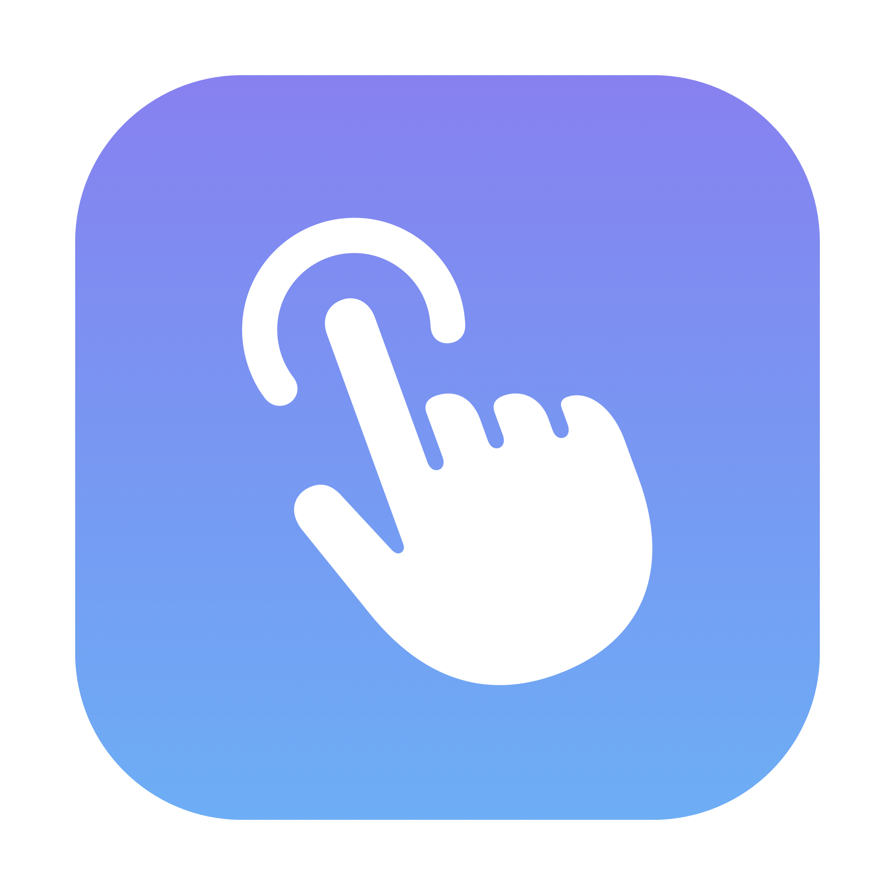
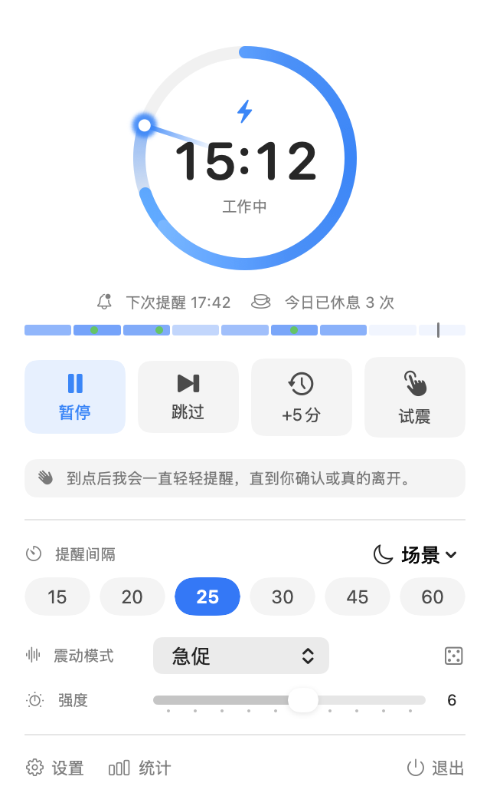
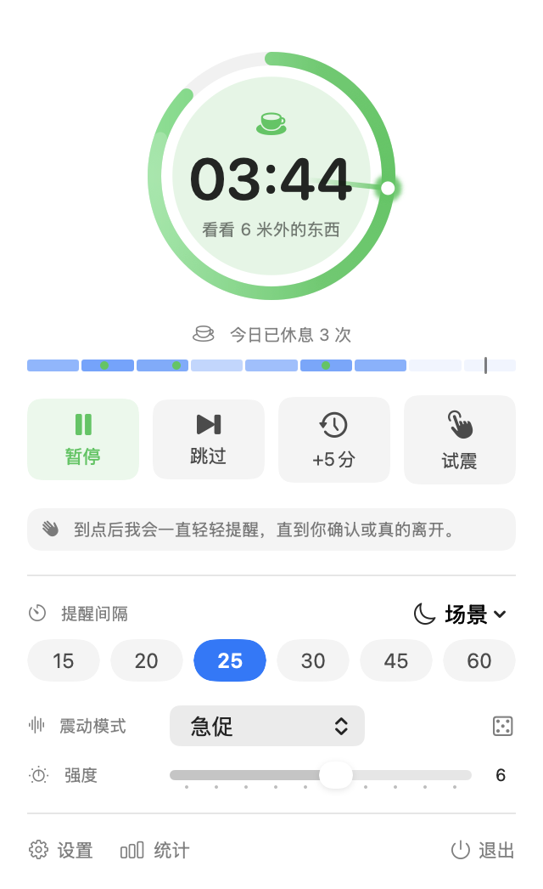
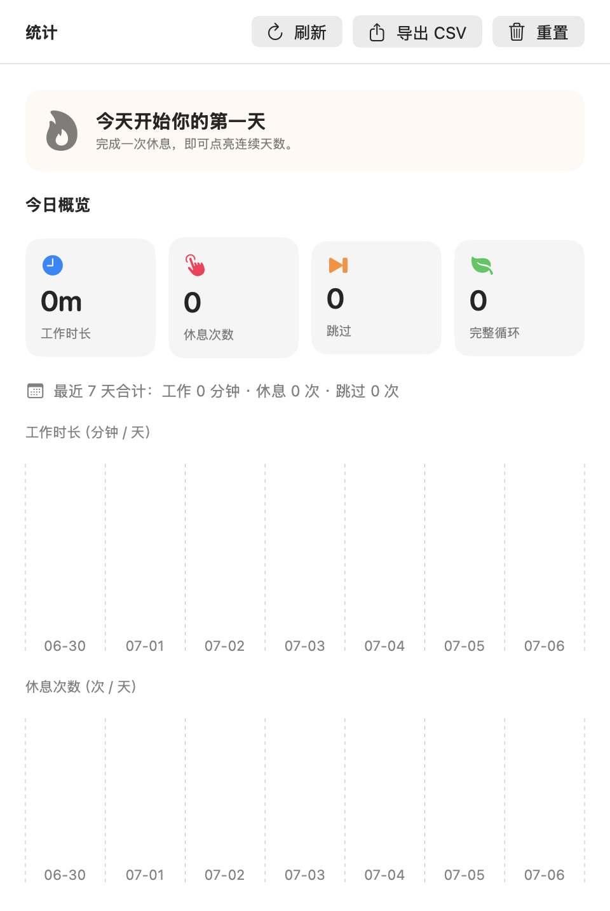
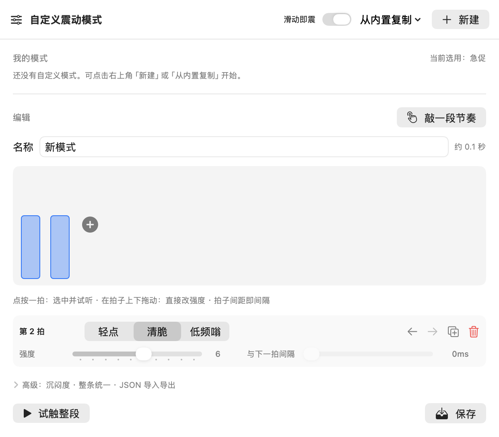

<div align="center">



# HapticBreak

**一个能被你「摸到」的休息提醒——不弹窗、不出声、不遮屏。**

到点时，它用触摸板在你手心轻轻拍一下。没有弹窗，没有声音，旁人毫无察觉——而你的心流，一次都不会被打断。

<a href="README.md">English</a> · <b>简体中文</b> · <a href="https://tmpbin.github.io/HapticBreak/">官网</a>


</div>

---

## 为什么会喜欢它

你一坐就是三小时。眼睛发干、脖子发僵、手腕发麻——身体早就拉响了警报，只是你没听见。

市面上的休息提醒，无非三招：

- **全屏遮罩**——强行霸占屏幕，把你从状态里硬拽出来。
- **系统通知**——一眼就滑走，一开专注模式还被静音。
- **声音提醒**——直到你在开会、在图书馆、在开放工位……社死现场。

它们都在跟你的注意力抢工作。而 HapticBreak 走的是一条一直都在、却没人用的通道：**自 2015 年起，每块 MacBook 触摸板下都压着一颗 Taptic Engine**——一个能被软件精确控制的线性震动马达，就在你此刻搭着的手腕正下方。到点时，它给你一下恰到好处的轻拍：**你收到了，世界没被打扰。**

---

## 魔性，藏在节奏里

一下震动只是一下震动，**而节奏，是一种感觉。** HapticBreak 把你的触摸板当成一件小小的乐器。

- **29 种内置震动模式**，分三种气质——**基础 / 自然 / 节奏**——从一记轻拍，到皮球落地的渐快弹跳，再到带劲的鼓点。
- **靠手感就能认出来的旋律。** 有些节奏太经典，光凭手心里的拍子你就能哼出调：
  - **命运**——贝多芬第五：_哒-哒-哒-**当**_。
  - **跺脚拍手**——全场大合唱的 _咚-咚-**啪**_（We Will Rock You）。
  - **铃儿响叮当**——_叮叮当、叮叮当_，直接敲进手心。
  - **生日快乐** · **两只老虎** · **上课铃**（西敏寺钟声）· **秘密任务**——中美欧日都从小听到大。
  - **理发店七拍**——那段「哒哒·哒哒哒」，最后两下你会忍不住在心里补上。
- **还能自己编。** 「震动模式编辑器」是一块节拍画布：点一拍即试听，上下拖动直接改强度——或点「**敲一段节奏**」，照着心里的调子连续点按：每次点按成为一拍，停顿多久就是间隔多久。模式以纯 JSON 导入导出（方便分享——或者让 AI 帮你写一段）。
- **凭手感调校。** 每个模式都跑在三轴引擎上（音色 × 强度 × 钝感），内置的「震动实验室」让你把它标定到**这台** Mac 最舒服的手感。

> 倒计时圆环也在合拍：它每秒释放一小簇能量；面板打开时，还可选一记极轻的震动「心跳」与之同步。

---

## 看一眼

| 控制面板 · 能量按秒释放的倒计时环 | 休息中 · 缓缓的呼吸光晕 |
|:--:|:--:|
|  |  |
| **统计 · 诚实的休息 + 连续天数** | **模式编辑器 · 编出你自己的节奏** |
|  |  |

---

## 安装

> HapticBreak 通过触摸板震动工作，仅在**内置 Force Touch 触摸板**或 **Magic Trackpad 2+** 上有效。

### 推荐：Homebrew（连装带升级，一条命令）

```bash
brew tap tmpbin/tap
brew install --cask --no-quarantine hapticbreak   # 未公证版本加 --no-quarantine 免「已损坏」提示
brew upgrade --cask hapticbreak                    # 以后升级一条命令
```

### 或者下载 `.dmg` 手动放行一次

未公证版本首次运行会被 macOS 拦截（Apple Silicon 上表现为「已损坏，应移到废纸篓」——这不是应用坏了，只是 Gatekeeper 对下载的未公证应用的默认态度）。任选其一放行：

```bash
# 方式 A：去掉隔离属性（最干净，一次即可）
xattr -dr com.apple.quarantine /Applications/HapticBreak.app

# 方式 B：右键 App →「打开」→ 弹窗再点「打开」（仅第一次）
```

---

## 60 秒上手

1. **启动。** 菜单栏出现一个小手图标和实时倒计时；首次运行控制面板会自己打开。
2. **感受。** 手指搭在触摸板上，点一下**试震**——再掷一把**骰子**随机换个模式，或直接翻模式菜单（选中即预览）。拖强度滑杆，调到手心最舒服的那一档。
3. **定节奏。** 选一个提醒间隔——默认 25 分钟，就很好。
4. **关上面板，忘掉它。** 设置到此结束。开会、全屏演示、勿扰模式、临时走开……它都会自动暂停；而且每次自动暂停，面板都会告诉你原因和什么时候回来。

### 提醒来了会发生什么

- 触摸板完整震一遍你选的模式，之后每隔约 20 秒用一记短促轻点再提示；菜单栏图标持续橙色发光。
- **想开始休息，怎么顺手怎么来：**
  - 三指**三击**触摸板；
  - 按 **`⌃⌥⏎`**；
  - 点一下倒计时**圆环**（或「开始休息」按钮）；
  - 或者干脆**起身走开**——离开 30 秒自动算数。
- **现在不方便？** 点「跳过」或「+5 分」，或者继续干活——几次轻推没有回应后，它会静默自动推迟。绝不无休止纠缠。
- 到点时你正打字打到一半？它会**等你敲完这一段**、出现自然停顿再震。
- 统计是**诚实的**：提醒响了不算数，你真的离开了才记一次休息。

---

## 进阶玩法

- **工作 / 休息循环**——设置 → 基本，把休息时长调到大于 0（例如 25 + 5）：确认提醒后进入休息倒计时，圆环变绿、化作缓缓的呼吸光晕，并轮换提示你伸展、远眺、喝水；完整循环自动计数。
- **场景快捷**——面板里的「场景」菜单是会自己归位的临时决定：**专注 90 分钟**（本轮拉长，下轮自动回到原节奏）、**静音 1 小时**（临时开个会）、**今天到此为止**（明早自动回来）。不像裸暂停，没有「忘了恢复」这回事。
- **一眼读懂今天**——面板里那条细带就是你的一天：色块深浅 = 每小时工作密度，绿点 = 真实休息，细线 = 现在。点它打开完整统计（7 天柱状图、连续天数、CSV 导出）。
- **调教提醒的性格**——设置 → 高级：轻推间隔与上限、推迟时长、提前轻点预告、打字时等停顿，以及每一项自动暂停的开关。
- **快捷键改成你的**——设置 → 高级 → 全局快捷键：点一下组合键、按下新的即可（默认 `⌃⌥Space` 暂停 · `⌃⌥S` 跳过 · `⌃⌥B` 立即震动 · `⌃⌥⏎` 开始休息）。无需辅助功能权限。
- **编一段自己的节奏**——设置 → 高级 → 自定义震动模式：在录制板上敲出节奏，或在画布上逐拍编排，随手试触，纯 JSON 分享。
- **标定到这台机器**——关于窗口 → 连点五次「致动器状态」，打开隐藏的**震动实验室**：确认三种音色在这台触摸板上手感对味（不对就换个备选手感），再把 1→10 强度整条试一遍。
- **适配你的菜单栏**——图标 + 倒计时、仅图标、极简进度环三种样式；可选屏幕轻闪与系统提示音作为补充通道。
- **三语界面**——简体中文 / English / 日本語，跟随系统或即时切换。

---

## 开发者

全部纯 Swift——命令行即可构建、测试与试震：

```bash
./build.sh release            # → build/HapticBreak.app（加 dmg 参数另出镜像）
swift test                    # 单元测试
scripts/release-check.sh      # 发布门禁：构建 → 单测 → CLI 冒烟 → 界面走查 → 打包

swift run HapticBreak --presets    # 把 29 个内置模式依次感受一遍（可选强度：--presets 8）
swift run HapticBreak --hapticlab  # 直接打开真机标定台
```

推送 `vX.Y.Z` 标签即触发[发布流水线](.github/workflows/release.yml)：测试、打包、从 [`CHANGELOG.md`](CHANGELOG.md) 抽取发布说明并创建 GitHub Release。配好签名与公证 Secret 后，同一条流水线产出「下载即开」的版本并支持应用内静默升级——设置说明见 [`packaging/autoupdate/README.md`](packaging/autoupdate/README.md)。

---

## 已知限制

- 未公证的独立分发版首次运行需手动放行（见上）；配置签名 Secret 后可彻底消除。
- 专注 / 勿扰检测为「最佳努力」（读取系统文件），系统改版可能失效，但不影响核心提醒。
- 精确震动走的是私有 API，理论上可能随 macOS 版本变化；已内置公开 API 自动回退。
